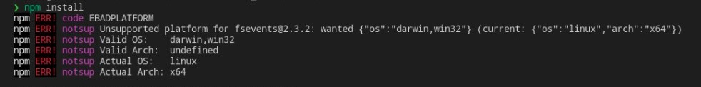
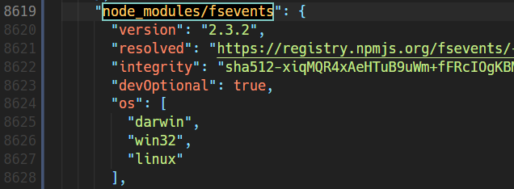

# Opinionated boilerplate for easily setup cross-platform app


This project is a starter template to develop desktop-based apps using Electron that combined with React js and TailwindCSS. Configured for Windows, MacOS, and (some) Linux.

Bootstrapped from [Create React App](https://github.com/facebook/create-react-app).

## Installation

Follow this steps to run it in your local machine:

1. Run global installation for electron

```
npm i -g electron
```

2. Clone this repository

```
git clone https://github.com/ilhambara/electron-reactail.git
```

3. Modify node_modules/fsevents (optional)

If you're facing an error like this:



Check your `package-lock.json` file and search for `node_modules/fsevents`. I have modified the file like this:



Note: This probably not a good approach to edit the `package-lock.json` file straightly like this. Therefore, I suggest you to look for another solution since I'm not find it yet. Here's the useful resources about [this issue](https://stackoverflow.com/questions/56103865/how-to-fix-unsupported-platform-for-fsevents1-2-9-wanted-osdarwin-arch) for your references.

4. Install dependencies

```
npm install
```

5. Run the app using this custom command:

```
npm run app
```

This custom command concurrently runs the development server on [http://localhost:3000](http://localhost:3000) but Electron prevents it from running on the browser.

## Tech Stacks

- Electron
- React js
- TailwindCSS

## References

- [Electron official docs](https://www.electronjs.org/docs/latest/)
- [electron-quick-start](https://github.com/electron/electron-quick-start)
